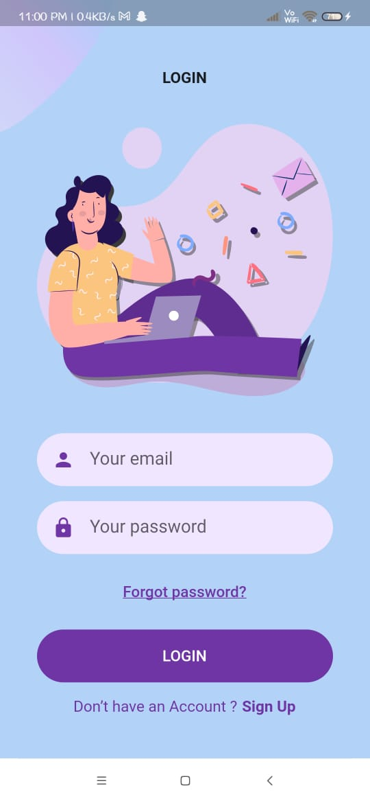
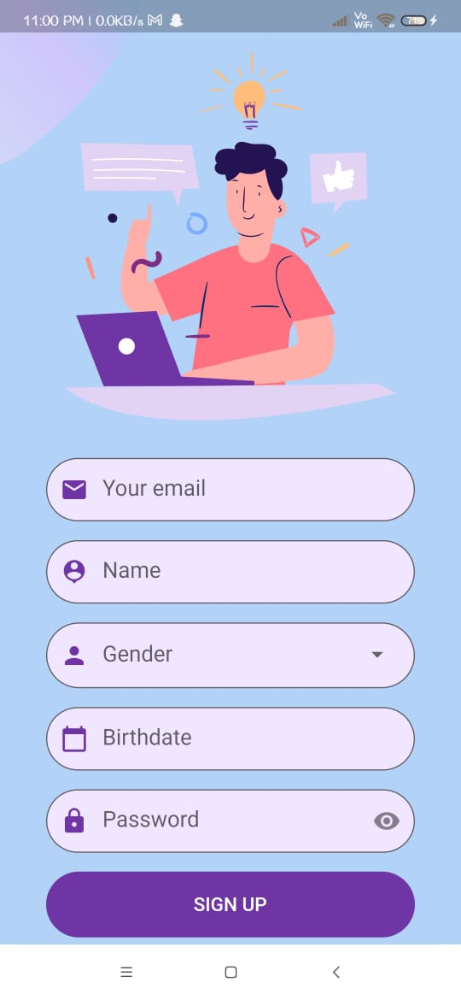
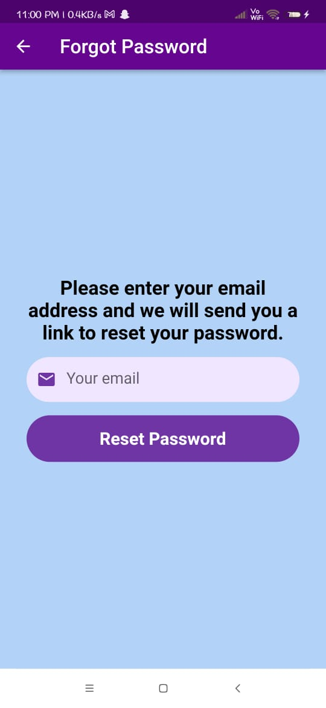
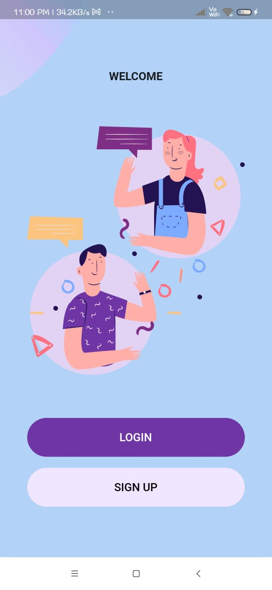
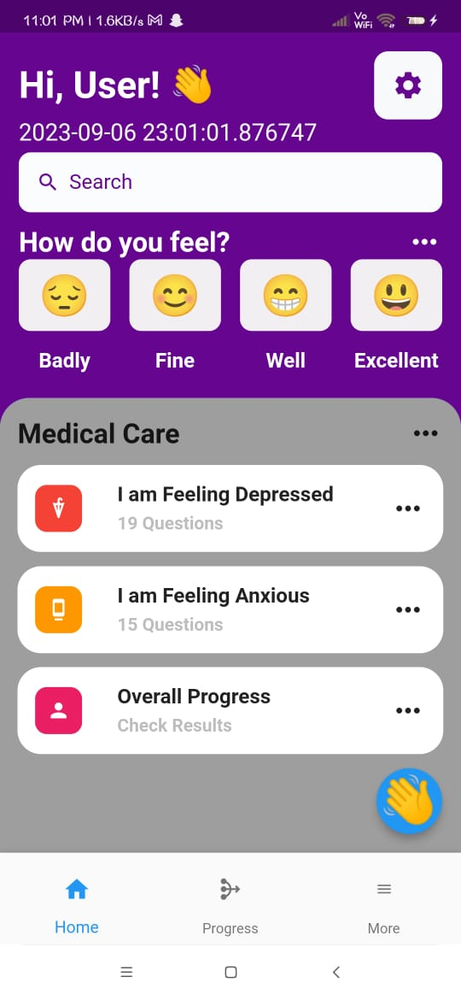
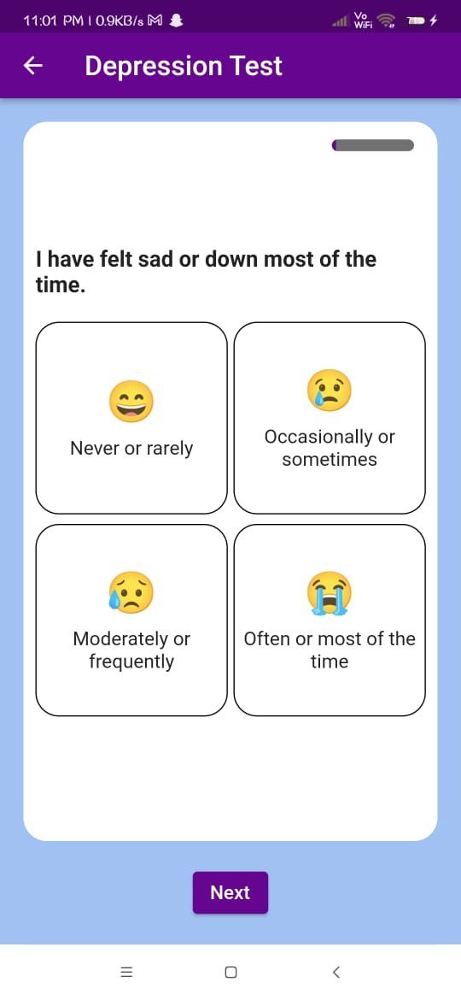
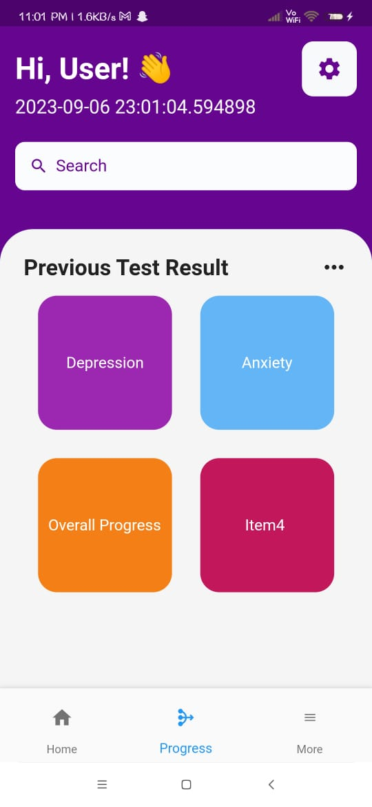
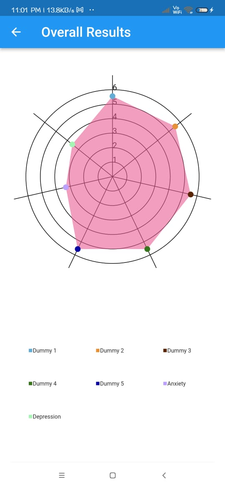

# Neuramap

Neuramap is a Flutter project that helps users with [brief description of what your app does].

## Screenshots

<div align="center">
    
    
    
</div>

<div align="center">
    
    
    
</div>

<div align="center">
    
    
</div>


## Getting Started

If you want to try out this project locally or contribute, follow these steps:

### Prerequisites

Make sure you have the following installed:

- [Flutter](https://flutter.dev/docs/get-started/install)
- [Dart](https://dart.dev/get-dart)

### Installation

1. Clone the repository:

   ```bash
   git clone https://github.com/LostParadise07/Neramap.git
   ```
2. Navigate to the project folder:
   ```bash
   cd Neramap
   ```
3. Install dependencies:
   ```bash
   flutter pub get
   ```
4. Usage:
   ```bash
   flutter run
   ```
